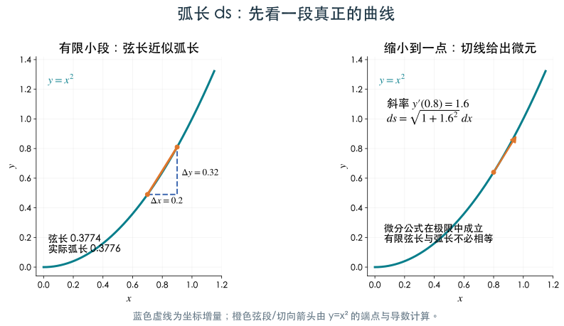
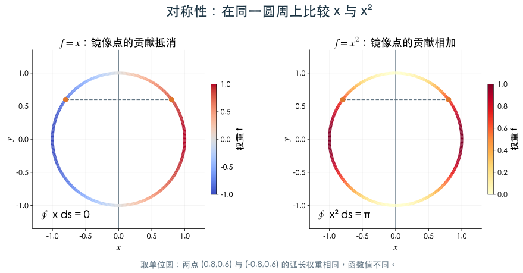
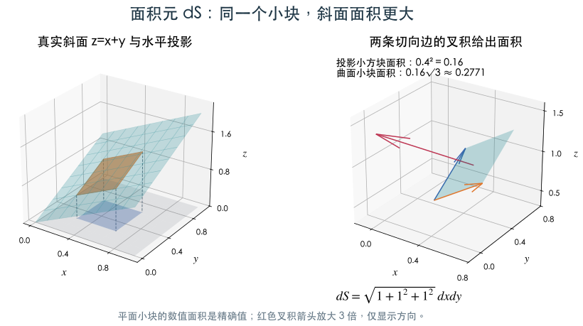
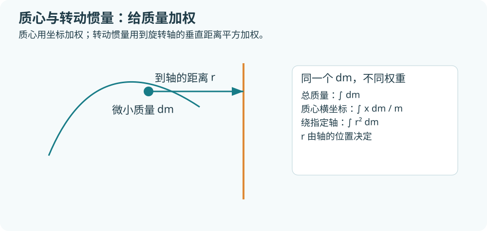

# 第4章 第一型曲线积分与曲面积分

> 学习目标：从“密度乘微小长度/面积”理解第一型积分，能自己建立积分式、选择参数或投影、完成计算，并处理质量、质心和转动惯量。对应本地第4章教材 §1—§3。例题由本教程编写；明确标注“本地作业”的题目除外。

## 1 从定积分走向曲线与曲面

以前计算细杆质量，常写 $m=\int_a^b\rho(x)\,dx$。若细杆弯成圆弧，密度仍然可以在每一点定义，但 $dx$ 只记录小段在横轴上的投影。真正的质量应为“线密度 × 小段的实际长度”。因此应写 $dm=\rho\,ds$，再沿整条曲线累加。

薄壳同理：取一小块实际曲面面积 $dS$，其质量为 $dm=\rho\,dS$。两个模型分别产生第一型曲线积分、第一型曲面积分。

|对象|微元|累积量|维度检查|
|---|---|---|---|
|弯曲细线 $L$|$ds$，实际弧长|$\int_L\rho\,ds$|质量/长度 × 长度 = 质量|
|薄壳 $\Sigma$|$dS$，实际曲面面积|$\iint_\Sigma\rho\,dS$|质量/面积 × 面积 = 质量|
|平面薄片 $D$|$dA=dxdy$|$\iint_D\rho\,dA$|二重积分是平面上的特例|
|空间实心物体 $\Omega$|$dV=dxdydz$|$\iiint_\Omega\rho\,dV$|三重积分处理体密度|

曲线是一维对象，最终化为一元定积分；曲面是二维对象，最终化为二重积分。它们是否在三维空间中，并不决定积分重数。

### 必需的先修工具

应会一元积分、二重积分与极坐标，能求偏导数，能用参数表示圆、直线和简单空间曲线。极坐标换元为 $x=r\cos\theta,y=r\sin\theta$，**平面面积元**为 $dxdy=r\,drd\theta$。这个 $r$ 是换元的面积伸缩因子；曲线上的 $ds$ 要另行计算。

## 2 第一型曲线积分的定义与性质

把分段光滑曲线 $L$ 分为小弧段，长度为 $\Delta s_i$，在每段取点 $M_i$。若最大弧段长度趋于零时，和式趋于与分割及取点无关的同一个极限，记为

$$
\int_L f\,ds=\lim_{\max\Delta s_i\to0}\sum_i f(M_i)\Delta s_i.
$$

在有限长分段光滑曲线上，连续函数可积。积分中的 $f$ 可以是密度，也可以是任意连续标量函数；$ds$ 始终是长度微元。取 $f=1$ 得曲线长度，取线密度得到质量。

1. **线性**：$\int_L(af+bg)ds=a\int_L fds+b\int_L gds$。
2. **分段相加**：一条折线可以逐段积分再相加。重合部分不能重复计入。
3. **方向无关**：沿同一条几何曲线反向走，第一型积分不变。
4. **估值**：若 $m\le f\le M$，则 $m\ell(L)\le\int_L fds\le M\ell(L)$。
5. **非负性**：$f\ge0$ 时积分非负；这常能立即排除错误结果。

当 $f\ge0$ 且 $L$ 在平面上时，可把曲线上的高度 $f$ 沿竖直方向竖起；由 $L$ 形成的柱面面积是 $\int_L fds$。高度有负值时，积分记录代数累积，不能直接称为几何面积。

## 3 如何计算 ds

### 3.1 参数法：最通用的公式

设曲线表示为 $\mathbf r(t)=(x(t),y(t),z(t))$，$a\le t\le b$，参数除有限点外正则，并将曲线覆盖一次，则

$$
ds=\sqrt{x'(t)^2+y'(t)^2+z'(t)^2}\,dt,
$$

$$
\int_L f(x,y,z)ds=\int_a^b f(x(t),y(t),z(t))\sqrt{x'^2+y'^2+z'^2}\,dt.
$$

平面曲线去掉 $z'$ 项。根号表示速度的长度：同样的时间小段 $dt$，走得越快，对应弧长越大。

**完整步骤**：写参数和范围 → 替换 $f$ → 求导并计算 $ds$ → 化为定积分 → 检查量纲、符号、覆盖次数。参数绕圆两周会把积分算两遍。

### 3.2 图形、极坐标与直线

|曲线表示|弧长元|范围从哪里来|
|---|---|---|
|$y=g(x)$|$ds=\sqrt{1+g'(x)^2}\,dx$|几何弧段的最小至最大 $x$|
|$x=h(y)$|$ds=\sqrt{1+h'(y)^2}\,dy$|几何弧段的最小至最大 $y$|
|$r=r(\theta)$|$ds=\sqrt{r^2+(r')^2}\,d\theta$|对应极角区间|
|圆 $x=a\cos t,y=a\sin t$|$ds=a\,dt$，$a>0$|整圆 $0\le t\le2\pi$|
|线段 $\mathbf r=A+t(B-A)$|$ds=\lVert B-A\rVert\,dt$|$0\le t\le1$|

极坐标公式来自对 $x=r\cos\theta,y=r\sin\theta$ 求导后相加平方。**不要把曲线的 $ds$ 写成 $r\,drd\theta$**，后者是平面面积元。

### 例1 整圆积分：本地第4章作业选择题1

设 $L:x^2+y^2=a^2$，$a>0$，计算 $\int_L(x+y)^2ds$。

取 $x=a\cos t,y=a\sin t,0\le t\le2\pi$，$ds=a\,dt$。因此

$$
\begin{aligned}
\int_L(x+y)^2ds
&=a^3\int_0^{2\pi}(\cos t+\sin t)^2dt\\
&=a^3\int_0^{2\pi}(1+\sin2t)dt=2\pi a^3.
\end{aligned}
$$

被积函数含长度平方，乘 $ds$ 后结果应是长度三次方；这也能识别漏掉半径 $a$ 的错误。

### 例2 空间螺线：本地第4章作业选择题2

$\Gamma:x=\cos t,y=\sin t,z=t,0\le t\le\pi$，求 $\int_\Gamma(x^2+y^2+z)ds$。

这里 $x'^2+y'^2+z'^2=\sin^2t+\cos^2t+1=2$，而 $f=1+t$，所以

$$
I=\sqrt2\int_0^\pi(1+t)dt=\sqrt2\left(\pi+\frac{\pi^2}{2}\right).
$$

曲线的平面投影是半圆，但实际曲线还向上移动，因此 $ds$ 比平面投影弧长更大。

### 例3 折线边界：本地第4章作业填空题1

$L$ 是顶点为 $(0,0),(1,0),(0,1)$ 的三角形边界，求 $\int_L(x+y)ds$。

- 横边 $y=0,0\le x\le1$：积分 $\int_0^1x\,dx=1/2$。
- 竖边 $x=0,0\le y\le1$：积分 $1/2$。
- 斜边 $x=t,y=1-t,0\le t\le1$：$f=1,ds=\sqrt2dt$，积分 $\sqrt2$。

总结果为 $1+\sqrt2$。斜边的 $ds$ 不能写成 $dt$，因为实际长度是 $\sqrt2$。

## 4 对称性如何减少计算

对称性通过“把曲线或曲面上的点成对交换”减少计算。需要同时满足：**几何积分域在该变换下不变，且微元保持不变**。镜像和坐标轮换在第一型积分中保持长度、面积。

- $L$ 关于 $y$ 轴对称，$f(-x,y)=-f(x,y)$：$\int_L fds=0$。
- 同一域上 $f(-x,y)=f(x,y)$：可以取半条曲线再乘2。
- 球面及某些圆周具有坐标轮换对称，可比较 $x^2,y^2,z^2$ 的积分。

**反例**：上半圆 $y\ge0$ 上 $y$ 不正负配对，$\int_L yds$ 通常不为零。对称性属于域与函数的组合，不能只看字母。

### 例4 倾斜大圆：本地第4章作业选择题4

$\Gamma$ 是球面 $x^2+y^2+z^2=R^2$ 与平面 $x+y+z=0$ 的交线，求 $\int_\Gamma3xy\,ds$。

平面过球心，交线是半径 $R$ 的大圆，长度 $2\pi R$。曲线对坐标轮换不变，所以三个平方积分相等，三个交叉项积分也相等。记 $A=\int_\Gamma x^2ds$、$B=\int_\Gamma xyds$，则

$$
3A=\int_\Gamma R^2ds=2\pi R^3.
$$

在曲线上 $(x+y+z)^2=0$，积分后得到 $3A+6B=0$，所以 $B=-\pi R^3/3$，最后 $\int_\Gamma3xy\,ds=-\pi R^3$。

这道题如果硬参数化会产生较多代数运算；先写曲线恒等式与对称关系，能直接求解。

## 5 第一型曲面积分与面积元

曲面分成小块，实际面积为 $\Delta S_i$，则

$$
\iint_\Sigma f\,dS=\lim_{\max\operatorname{diam}\Delta\Sigma_i\to0}\sum_i f(M_i)\Delta S_i.
$$

取 $f=1$ 得曲面面积，取面密度得薄壳质量。第一型曲面积分也具有线性、分片相加、估值和方向无关等性质。

### 5.1 图形曲面的投影公式

若 $\Sigma:z=g(x,y)$，投影域为 $D$，且曲面可单值表示，则

$$
dS=\sqrt{1+g_x^2+g_y^2}\,dxdy,
$$

$$
\iint_\Sigma f(x,y,z)dS=\iint_D f(x,y,g(x,y))\sqrt{1+g_x^2+g_y^2}\,dxdy.
$$

可类比斜面的实际面积与水平投影面积：坡度越大，修正因子越大。换成 $x=h(y,z)$ 或 $y=k(z,x)$ 时，公式相应换字母。

投影域由**全部限制条件**确定。例如 $z=x^2+y^2,0\le z\le2$ 投影为圆盘 $x^2+y^2\le2$。对整球面投影时，上下半球对应同一圆盘，需要分片或改用球面参数。

### 5.2 参数曲面的面积元

设 $\mathbf r(u,v)$ 覆盖曲面一次，则

$$
dS=\lVert\mathbf r_u\times\mathbf r_v\rVert\,dudv.
$$

叉积的长度是两条微小切向边所形成平行四边形的面积。交换 $u,v$ 会使叉积反向，但长度不变，这也说明第一型面积积分与定向无关。

|曲面|参数与范围|面积元|
|---|---|---|
|球面半径 $a$|$x=a\sin\phi\cos\theta,y=a\sin\phi\sin\theta,z=a\cos\phi$|$a^2\sin\phi\,d\phi d\theta$；整球 $0\le\phi\le\pi,0\le\theta\le2\pi$|
|圆柱侧面|$x=a\cos\theta,y=a\sin\theta,z=v$|$a\,d\theta dv$|
|圆锥 $z=kr$|$x=r\cos\theta,y=r\sin\theta,z=kr$|$r\sqrt{1+k^2}\,drd\theta$|
|图形面 $z=g(x,y)$|$\mathbf r(x,y)=(x,y,g(x,y))$|$\sqrt{1+g_x^2+g_y^2}\,dxdy$|

球面公式里的 $\phi$ 是从 $+z$ 轴量起的极角，上半球取 $0\le\phi\le\pi/2$。不要混用纬度参数与极角参数。

## 6 曲面积分完整例题

### 例5 斜平面上的密度：本地第4章作业填空题3

$\Sigma:x/2+y+z=1$ 在第一卦限的部分，求 $\iint_\Sigma(x+2y+2z+4)dS$。

曲面写成 $z=1-x/2-y$，故 $g_x=-1/2,g_y=-1$，$dS=3dxdy/2$。投影域为 $x\ge0,y\ge0,x/2+y\le1$，三角形面积是 $1$。又在曲面上 $x+2y+2z+4=6$，于是 $I=6\cdot(3/2)\cdot1=9$。

这里先用曲面方程化简被积函数，可避免不必要的逐项积分。

### 例6 抛物面：本地第4章作业计算题2

$\Sigma:z=x^2+y^2,0\le z\le2$，求 $\iint_\Sigma(x^2+y^2)dS$。

投影域是半径 $\sqrt2$ 的圆盘，$dS=\sqrt{1+4x^2+4y^2}\,dxdy$。在投影平面改用极坐标：

$$
I=\int_0^{2\pi}\int_0^{\sqrt2}r^3\sqrt{1+4r^2}\,drd\theta.
$$

令 $u=1+4r^2$，$r^3dr=(u-1)du/32$，则

$$
I=\frac\pi{16}\int_1^9(u^{3/2}-u^{1/2})du
=\frac\pi{16}\left[\frac25u^{5/2}-\frac23u^{3/2}\right]_1^9
=\frac{149\pi}{30}.
$$

两个因子承担不同工作：$\sqrt{1+4r^2}$ 把投影面积还原为曲面面积，$r$ 把直角坐标面积换成极坐标面积；两者都要保留。

### 例7 球面的平方积分

在整球面 $x^2+y^2+z^2=a^2$ 上，计算 $\iint_\Sigma x^2dS$。

三个平方积分相等，总和为 $a^2\cdot4\pi a^2$，因此 $\iint_\Sigma x^2dS=4\pi a^4/3$。整球上 $\iint_\Sigma xdS=0$，但上半球上 $\iint_\Sigma zdS=\pi a^3$，后者可由球面参数直接验证。

### 例8 圆柱侧面：本地第4章作业填空题5

$\Sigma:x^2+y^2=a^2,0\le z\le h$，求 $\iint_\Sigma x^2dS$。

取 $x=a\cos\theta,y=a\sin\theta,z=v$，$dS=a\,d\theta dv$。结果为

$$
I=a^3\int_0^h dv\int_0^{2\pi}\cos^2\theta\,d\theta=\pi a^3h.
$$

题目只给圆柱侧面，不应添加上下底面。

## 7 几何形体积分的统一视角

教材 §3 将区间、平面区域、立体、曲线与曲面统记为 $G$，相应度量元为 $dG$，统一写作 $\int_G f\,dG$。这是“在相应几何对象上按长度、面积或体积累加”的记号。

在连续、有限度量的常见对象上，线性、可加性、单调性与估值一致。若 $G$ 连通且紧，$f$ 连续，可写积分中值公式 $\int_G f\,dG=f(\xi)m(G)$。这里 $m(G)$ 是总长度、面积或体积。**连通条件不能随意删掉**：不连通的两部分上分别恒取0与1时，平均值可能为1/2，而任何点都不取1/2。

旋转体还可联系此前知识：$y=f(x)\ge0$ 绕 $x$ 轴旋转，体积为 $\pi\int_a^b f(x)^2dx$，旋转侧面积为 $2\pi\int_a^b f(x)\sqrt{1+f'(x)^2}dx$。后一式来自“小圆周 $2\pi f(x)$ × 小母线弧长 $ds$”。

## 8 质量、质心与转动惯量

### 8.1 统一写成 dm

线、面、体的质量元分别是 $dm=\rho ds,\rho dS,\rho dV$。总质量 $m=\int dm$，当 $m>0$ 时

$$
\bar x=\frac{\int x\,dm}{m},\quad
\bar y=\frac{\int y\,dm}{m},\quad
\bar z=\frac{\int z\,dm}{m}.
$$

质心是质量加权平均。均匀密度可以约掉；非均匀密度必须留在分子、分母。几何对称且密度也对称时，质心在相应对称平面上。

### 例9 均匀抛物面壳的质心：本地第4章作业计算题4

$\Sigma:z=(x^2+y^2)/2,z\le2$，均匀面密度 $\rho$。曲面轴对称，所以 $\bar x=\bar y=0$。投影 $0\le r\le2$，面积元 $dS=r\sqrt{1+r^2}drd\theta$。

$$
m=2\pi\rho\int_0^2r\sqrt{1+r^2}dr
=\frac{2\pi\rho}{3}(5\sqrt5-1).
$$

$$
\int_\Sigma z\,dm
=\pi\rho\int_0^2r^3\sqrt{1+r^2}dr
=\pi\rho\left[\frac15(1+r^2)^{5/2}-\frac13(1+r^2)^{3/2}\right]_0^2
=\frac{\pi\rho}{15}(50\sqrt5+2).
$$

因此

$$
\bar z=\frac{25\sqrt5+1}{5(5\sqrt5-1)}\approx1.118.
$$

结果在 $0$ 与 $2$ 之间，符合质心应在高度范围内的检查。若误把 $dS$ 换成 $dxdy$，得到的是投影薄片的加权值，模型已经改变。

### 8.2 转动惯量要先找轴

物体绕轴 $\ell$ 的转动惯量为 $I_\ell=\int r_\ell^2dm$，$r_\ell$ 是点到轴的垂直距离。因此

$$
I_x=\int(y^2+z^2)dm,\quad I_y=\int(z^2+x^2)dm,\quad I_z=\int(x^2+y^2)dm.
$$

例：半径 $a$、总质量 $m$ 的均匀圆环位于 $z=0$。每个点到 $z$ 轴距离为 $a$，故 $I_z=ma^2$。对称性给出 $I_x=I_y=ma^2/2$。

对通过原点、单位方向向量为 $\mathbf e$ 的轴，距离平方为 $\lVert\mathbf r\rVert^2-(\mathbf r\cdot\mathbf e)^2$。平行轴定理 $I_\ell=I_{\ell_0}+md^2$ 要求 $\ell_0$ 通过质心，两轴平行且相距 $d$。

### 8.3 引力应用：理解向量与距离幂

设观察点为 $\mathbf r_0$、质量为 $m_0$，源物体上点为 $\mathbf r$，质量元为 $dm$。源对观察点的引力为

$$
\mathbf F=Gm_0\int\frac{\mathbf r-\mathbf r_0}{\lVert\mathbf r-\mathbf r_0\rVert^3}\,dm.
$$

分母三次方与分子距离向量共同给出“大小与距离平方成反比、方向指向源”。本式适用于观察点与源分离的常规计算；位于源上的奇点需要另作分析。

例如均匀圆环半径 $a$、质量 $M$，轴上点 $(0,0,h)$ 的质量为 $m_0$。水平分量对称抵消，每个源点与观察点距离均为 $\sqrt{a^2+h^2}$，因此

$$
F_z=-\frac{GMm_0h}{(a^2+h^2)^{3/2}}.
$$

$h>0$ 时力向下，$h=0$ 时合力为零。通过对称性先判断分量，能显著减少积分计算。

## 9 考前方法选择与易错点

|题目特征|优先方法|落笔前检查|
|---|---|---|
|圆、螺线、空间交线|参数法|覆盖一次，$ds$ 含所有坐标导数|
|折线、分片曲面|分段/分片相加|范围完整，公共边界不重复计面积|
|$z=g(x,y)$|投影到 $Oxy$|投影域及面积修正因子|
|球面、圆柱侧面|标准参数或对称性|整面还是局部，是否有端盖|
|奇函数、轮换结构|对称性|域和函数同时满足条件|
|质心|先算质量再算力矩|线密度、面密度或体密度|
|转动惯量|先写到轴的距离平方|轴是否过原点、是否倾斜|

常见错误是漏 $ds$ 或 $dS$ 的伸缩因子、漏极坐标 $r$、把半球当整球、把柱面当封闭柱体、把壳当实心物体。先写对象和微元，再写积分式，能避免大部分错误。

## 10 自测与完整解答

建议先独立作答，再阅读答案；无需点击判分或记录学习进度。

**题1** 上半圆 $x^2+y^2=a^2,y\ge0$ 上，计算 $\int_L yds$。

**题2** 曲线 $y=x^2,0\le x\le1$ 上，计算 $\int_L xds$。

**题3** $\Sigma:z=x+y$ 在 $0\le x,y\le1$ 上，求曲面面积。

**题4** 上半球 $x^2+y^2+z^2=a^2,z\ge0$，求 $\iint_\Sigma zdS$。

**题5** 上半圆弧均匀线密度，求质心。

**题6** 圆柱侧面 $x^2+y^2=a^2,0\le z\le h$ 均匀，总质量 $m$，求绕 $z$ 轴的转动惯量。

### 解答

1. 取 $x=a\cos t,y=a\sin t,0\le t\le\pi$，$ds=adt$，结果 $a^2\int_0^\pi\sin tdt=2a^2$。
2. $ds=\sqrt{1+4x^2}dx$，$\int_0^1x\sqrt{1+4x^2}dx=[(1+4x^2)^{3/2}/12]_0^1=(5\sqrt5-1)/12$。
3. $g_x=g_y=1$，面积 $\int_0^1\int_0^1\sqrt3dxdy=\sqrt3$。
4. 球面参数给 $2\pi a^3\int_0^{\pi/2}\cos\phi\sin\phi d\phi=\pi a^3$。
5. 对称性给 $\bar x=0$，$m=\rho\pi a$，$\int ydm=2\rho a^2$，所以 $\bar y=2a/\pi$。
6. 每点到轴的距离均为 $a$，$I_z=a^2\int dm=ma^2$。

回看：题1和题4都在求坐标的累积，但一个沿曲线、一个沿曲面；它们的 $a$ 次幂不同，来自微元的维度不同。
