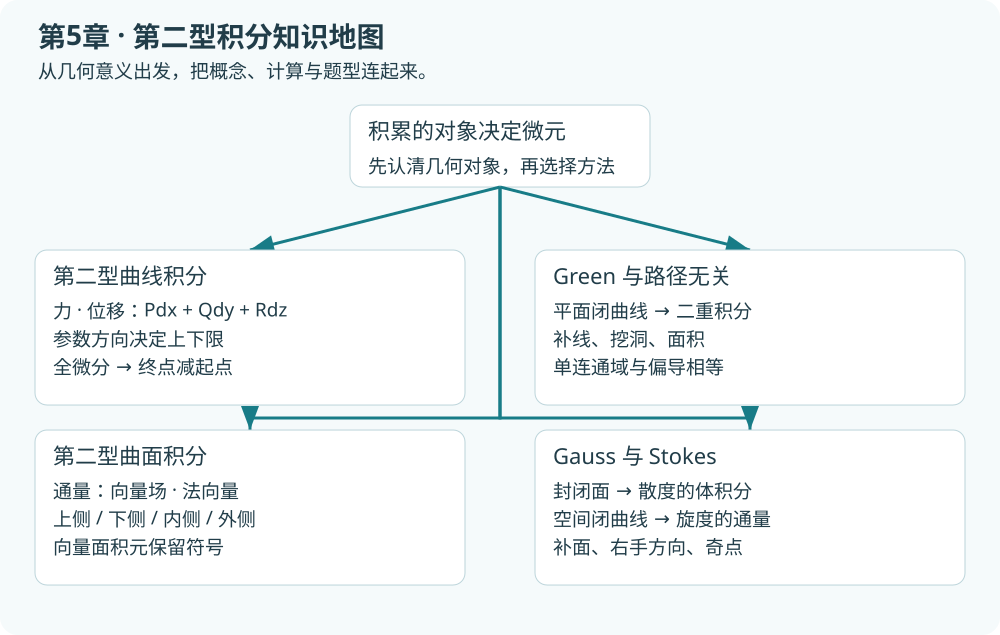
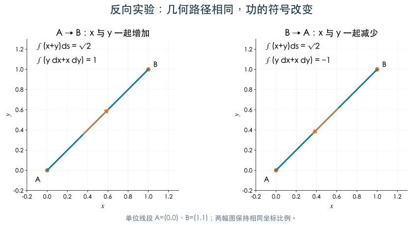
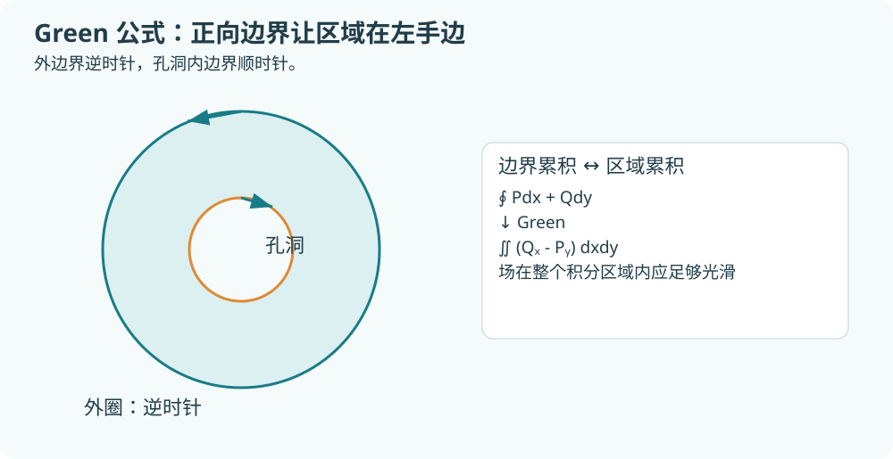
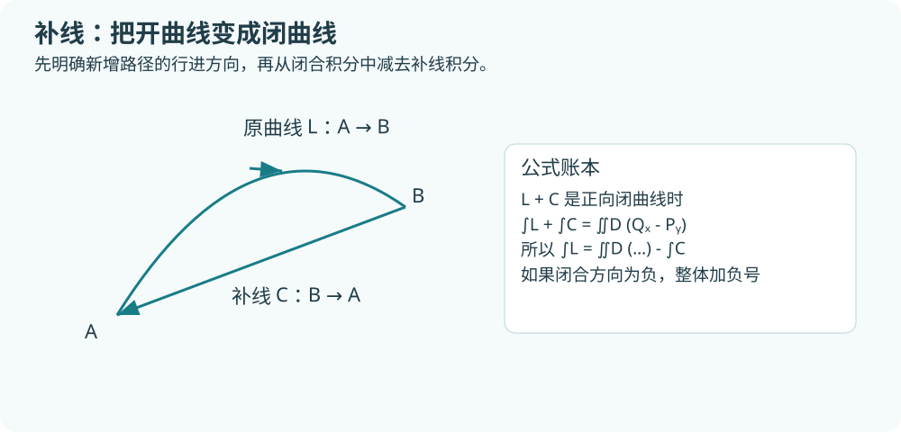
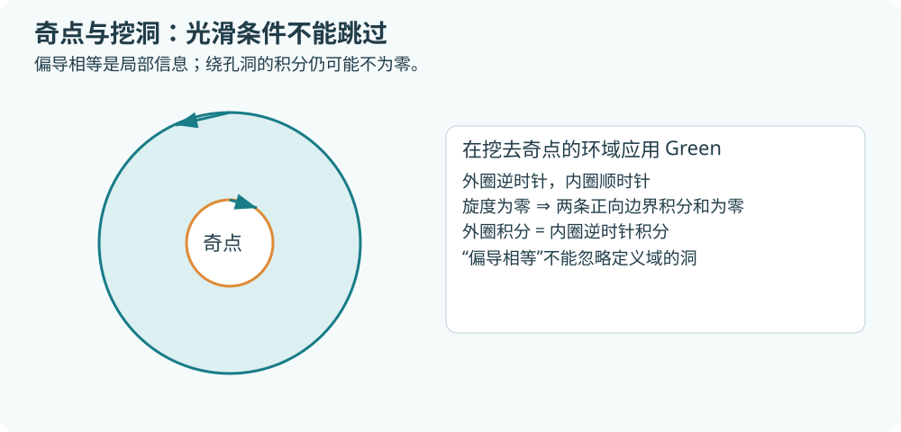
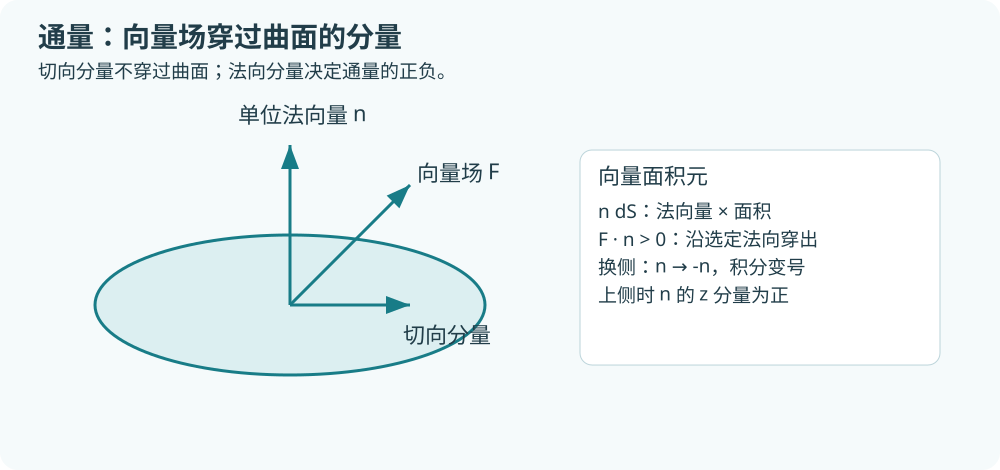
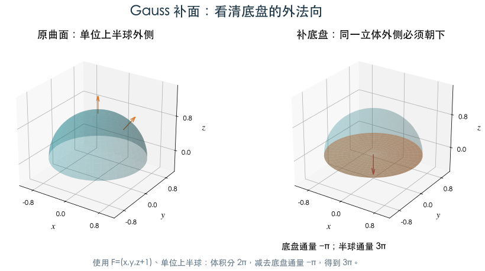
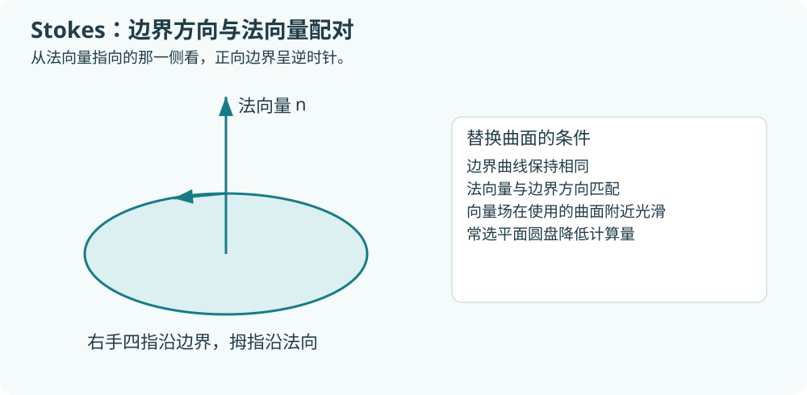
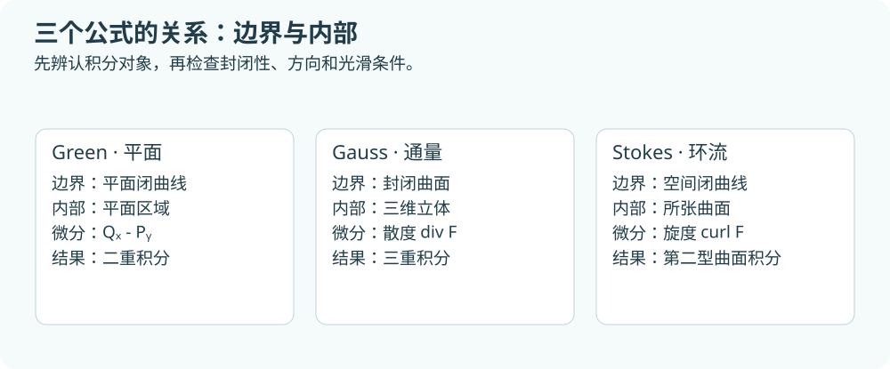

# 第5章 第二型曲线积分与曲面积分

> 学习目标：理解做功与通量中的方向，能直接参数化计算，能判断何时使用 Green、Gauss、Stokes，能处理路径无关、补线、补面与奇点。对应本地第5章教材 §1—§5。先读第4章的参数、投影和微元；本章复用这些工具，但方向必须保留。

## 1 从质量累积走向做功

第一型积分累积标量函数乘长度。现在设质点沿曲线运动，力为 $\mathbf F=(P,Q,R)$，微小位移为 $d\mathbf r=(dx,dy,dz)$。微小功为

$$
dW=\mathbf F\cdot d\mathbf r=Pdx+Qdy+Rdz.
$$

点积只保留力沿位移方向的分量：顺着运动方向的力做正功，反向的力做负功，垂直于运动方向的力做功为零。把微小功沿有向曲线累加，得到第二型曲线积分。

$$
\int_L Pdx+Qdy+Rdz=\int_L\mathbf F\cdot d\mathbf r.
$$

在分割和式中，$\Delta x_i,\Delta y_i,\Delta z_i$ 是按行进方向取的坐标增量。它们可以为负；这与非负弧长 $\Delta s_i$ 有本质区别。

## 2 直接计算与两型关系

### 2.1 参数法保留导数的符号

设 $\mathbf r(t)=(x(t),y(t),z(t))$，随 $t$ 从 $a$ 到 $b$ 按题目方向行进，则

$$
\int_L Pdx+Qdy+Rdz
=\int_a^b\big(P(\mathbf r(t))x'(t)+Q(\mathbf r(t))y'(t)+R(\mathbf r(t))z'(t)\big)dt.
$$

这里没有速度长度的根号，也没有导数的绝对值。反向取 $b$ 到 $a$ 时积分变号。如果同一坐标在曲线上先增后减，用参数统一处理比直接设上下限更稳妥。

### 2.2 用有向单位切向量连接两型

设 $\mathbf T=(\cos\alpha,\cos\beta,\cos\gamma)$ 为沿行进方向的单位切向量，则 $d\mathbf r=\mathbf Tds$，因此

$$
\int_L Pdx+Qdy+Rdz
=\int_L(P\cos\alpha+Q\cos\beta+R\cos\gamma)ds.
$$

反向后 $ds$ 不变，$\mathbf T$ 反向，所以第二型变号。

|比较|第一型曲线积分|第二型曲线积分|
|---|---|---|
|典型模型|线质量|变力做功|
|微元|$ds$|$dx,dy,dz$|
|参数公式的乘数|$\lVert\mathbf r'\rVert$|各坐标导数，有符号|
|反向|不变|变号|
|可先用对称性吗|常可直接奇偶配对|需连同切向方向、各项一起分析|

### 例1 同一条线段的两种积分

从 $A=(0,0)$ 到 $B=(1,1)$，取 $x=t,y=t,0\le t\le1$。

- $\int_L(x+y)ds=\int_0^1 2t\sqrt2dt=\sqrt2$。
- $\int_L ydx+xdy=\int_0^1(t+t)dt=1$。

反向走，第一式仍为 $\sqrt2$，第二式为 $-1$。不能只把第二式中的 $dx,dy$ 都换成 $ds$。

### 例2 分段路径：本地第5章作业第二次填空题1

从 $A=(1,1)$ 沿抛物线 $y=x^2$ 到 $B=(-1,1)$，再沿直线到 $C=(0,2)$，求 $\int_L y^2dx-xdy$。

第一段取 $x=t,y=t^2,t:1\to-1$，则

$$
I_{AB}=\int_1^{-1}(t^4-2t^2)dt=\frac{14}{15}.
$$

第二段取 $x=-1+t,y=1+t,0\le t\le1$，则

$$
I_{BC}=\int_0^1\big((1+t)^2-(-1+t)\big)dt
=\int_0^1(2+t+t^2)dt=\frac{17}{6}.
$$

总和为 $113/30$。第一段横坐标递减，保留 $1\to-1$ 是方向正确的关键。

## 3 Green 公式：平面边界变为区域

设平面区域 $D$ 的边界为分段光滑闭曲线，$P,Q$ 在包含 $\overline D$ 的开邻域内具有连续一阶偏导数，则

$$
\oint_{\partial D^+}Pdx+Qdy=\iint_D(Q_x-P_y)dxdy.
$$

$\partial D^+$ 的正方向是：沿边界走时区域在左手边。简单外边界是逆时针；有孔洞时，内边界是顺时针。

### 3.1 为什么只剩边界

把区域分成许多小块，沿每块正向边界累积。两个相邻小块的公共边走向相反，贡献抵消，只留下最外层和孔洞边界。$Q_x-P_y$ 描述局部环流密度，二重积分把这些局部贡献加起来。这一解释也帮助记住公式中的减号顺序。

### 例3 椭圆上的闭积分：本地第5章作业第二次选择题1

$L:4x^2+y^2=8x$ 的正向边界，求 $\oint_L e^{y^2}dx+xdy$。

取 $P=e^{y^2},Q=x$，则 $Q_x-P_y=1-2ye^{y^2}$。椭圆为 $4(x-1)^2+y^2=4$，半轴为 $1,2$，关于 $x$ 轴对称，因此奇函数项二重积分为零。结果等于椭圆面积 $\pi\cdot1\cdot2=2\pi$。

这里函数不是常数，但求偏导后利用区域对称性把计算化为面积。

### 3.2 面积公式

选 $P=-y/2,Q=x/2$，有 $Q_x-P_y=1$，于是

$$
\operatorname{Area}(D)=\frac12\oint_{\partial D^+}(xdy-ydx).
$$

也可写 $\operatorname{Area}(D)=\oint xdy=-\oint ydx$。这些等式要求正向简单边界；反向积分得到负面积，若只求几何面积应调整方向。

对椭圆 $x=a\cos t,y=b\sin t,0\le t\le2\pi$，$xdy-ydx=abdt$，所以面积为 $\pi ab$。

## 4 补线与奇点：使用 Green 的两道关口

### 4.1 开曲线先补成闭曲线

对开曲线 $L:A\to B$，补线 $C:B\to A$。若 $L+C$ 为正向边界，则

$$
\int_LPdx+Qdy=\iint_D(Q_x-P_y)dxdy-\int_CPdx+Qdy.
$$

**补线也要计算，不能只算区域积分。** 若闭合方向为顺时针，二重积分前应加负号。

### 例4 上半圆弧补直径

$L$ 沿单位圆上半圆从 $(1,0)$ 到 $(-1,0)$，计算 $\int_L(-y\,dx+x\,dy)$。补直径 $C$ 从 $(-1,0)$ 到 $(1,0)$。闭合方向为逆时针，$Q_x-P_y=2$；直径上 $y=0,dy=0$，补线积分为零。因此 $I=2\cdot\pi/2=\pi$。

### 4.2 有奇点时不能跨过去套公式

考虑

$$
P=-\frac{y}{x^2+y^2},\quad Q=\frac{x}{x^2+y^2}.
$$

在原点外 $Q_x-P_y=0$，但原点没有定义。对绕原点的单位圆，参数化得

$$
\oint_L\frac{xdy-ydx}{x^2+y^2}=\int_0^{2\pi}dt=2\pi.
$$

因此“偏导相等”不意味着绕孔洞积分为零。若在原点周围挖小圆，剩余环域上的场光滑，可用 Green；外圈逆时针积分与内圈逆时针积分相等。

### 例5 变形分母：本地第5章作业第二次计算题5

$L:(x-1)^2+y^2=4$ 正向，求

$$
I=\oint_L\frac{xdy-ydx}{x^2+2y^2}.
$$

原点位于圆内部。令 $P=-y/(x^2+2y^2),Q=x/(x^2+2y^2)$，在原点外直接求导得到 $Q_x-P_y=0$。挖去小椭圆 $x^2+2y^2=\varepsilon^2$，Green 给外圈积分等于小椭圆的逆时针积分。取 $x=\varepsilon\cos t,y=\varepsilon\sin t/\sqrt2$，得到

$$
I=\int_0^{2\pi}\frac{\varepsilon^2/\sqrt2}{\varepsilon^2}dt=\sqrt2\pi.
$$

内边界在环域正向中为顺时针；写成“外圈等于小圈逆时针”时已经把负号移到另一侧。

## 5 路径无关与全微分

### 5.1 三个等价说法

在连通开域内，$P,Q$ 连续且满足适当可微条件时，下列关系相互连接：积分只与起终点有关；任意闭路积分为零；存在单值势函数 $u$ 使 $du=Pdx+Qdy$。一旦找到 $u$，就有

$$
\int_A^B Pdx+Qdy=u(B)-u(A).
$$

**常用充分条件**：在单连通开域内，$P,Q$ 一阶连续可微且 $P_y=Q_x$，则路径无关。单连通可直观理解为闭路能够在域内连续缩成一点；穿孔平面不满足。偏导相等是全微分的必要条件，作为全局充分条件时需要控制定义域。

空间情况类似：寻找 $\nabla u=(P,Q,R)$；在常见单连通域中，连续一阶偏导下 $\operatorname{curl}\mathbf F=0$ 可以推出势函数存在。考试中若直接构造出单值 $u$，就可以用端点计算，无需另用拓扑结论。

### 5.2 求势函数：先积分再补“常数函数”

由 $u_x=P$ 对 $x$ 积分，写 $u=\int Pdx+g(y)$；再对 $y$ 求导与 $Q$ 比较，确定 $g$。这里的积分“常数”可以依赖另一个变量。

### 例6 全微分与端点：本地第5章作业第二次计算题3

$$
P=2xy^3-y^2\cos x,\quad Q=1-2y\sin x+3x^2y^2.
$$

有 $P_y=6xy^2-2y\cos x=Q_x$，场在整个平面光滑。由 $u_x=P$ 得

$$
u=x^2y^3-y^2\sin x+g(y).
$$

与 $Q$ 比较得 $g'(y)=1$，可取

$$
u=x^2y^3-y^2\sin x+y.
$$

从 $(0,0)$ 到 $(\pi/2,1)$ 的积分为 $u(\pi/2,1)-u(0,0)=\pi^2/4$。

### 例7 空间曲线可直接消掉：本地第5章作业第二次计算题1

$$
\omega=(x^2-yz)dx+(y^2-xz)dy+(z^2-xy)dz.
$$

观察到 $u=(x^3+y^3+z^3)/3-xyz$，则 $du=\omega$。沿螺线从 $A=(1,0,0)$ 到 $B=(1,0,2\pi)$，积分为 $8\pi^3/3$。找到势函数后，曲线的复杂程度不再增加计算量。

## 6 第二型曲面积分：通量与定向

设流速或其他向量场为 $\mathbf F=(P,Q,R)$，选定曲面单位法向量 $\mathbf n=(n_x,n_y,n_z)$。穿过小曲面块的有向通量为 $\mathbf F\cdot\mathbf n\,dS$，积分记为

$$
\iint_\Sigma\mathbf F\cdot\mathbf n\,dS
=\iint_\Sigma P\,dydz+Q\,dzdx+R\,dxdy.
$$

本章讨论可定向的双侧曲面：可在整片曲面上连续选取一致的单位法向量。莫比乌斯带不能这样选取全局法向，本章的通量公式不直接用于它。

这里 $dydz,dzdx,dxdy$ 表示**有向投影面积元**，对应 $n_xdS,n_ydS,n_zdS$。顺序是循环顺序 $yz,zx,xy$，不是三个无符号面积元随意相加。

上侧：$n_z>0$；下侧：$n_z<0$。闭合曲面的外侧指向所围立体之外，内侧与之相反。柱面侧面的外侧通常根据径向判断，不能统一写成“上侧”。

### 6.1 图形曲面的合一投影法

对 $z=g(x,y)$ 上侧，有

$$
\mathbf n\,dS=(-g_x,-g_y,1)dxdy,
$$

因此

$$
\iint_\Sigma P\,dydz+Q\,dzdx+R\,dxdy
=\iint_D(-Pg_x-Qg_y+R)dxdy,
$$

场的 $z$ 必须替换为 $g(x,y)$。下侧将整体乘 $-1$。

第一型面积元中的根号在这里被单位法向量的归一化分母抵消，所以合一公式不再乘 $\sqrt{1+g_x^2+g_y^2}$。若选其他投影，正 $x$ 法向的 $x=h(y,z)$ 用 $(1,-h_y,-h_z)dydz$，正 $y$ 法向的 $y=k(z,x)$ 用 $(-k_x,1,-k_z)dzdx$。

### 6.2 参数法与分面投影

对参数曲面 $\mathbf r(u,v)$，若 $\mathbf r_u\times\mathbf r_v$ 指向题目指定侧，则通量为

$$
\iint \mathbf F(\mathbf r(u,v))\cdot(\mathbf r_u\times\mathbf r_v)dudv.
$$

若方向相反，整体乘 $-1$。不要给叉积取长度，否则会丢失方向。

分面投影法也可以逐项处理 $P\,dydz,Q\,dzdx,R\,dxdy$：每一项投到对应坐标面，并按相应法向分量决定正负；投影多值则分片。三项转到一个坐标面时，合一投影法通常更短。

### 例8 下侧平面：本地第5章作业第三次选择题2

$\Sigma:x+y+z=1$ 在第一卦限的下侧，求 $\iint_\Sigma zdxdy$。投影域 $D:x,y\ge0,x+y\le1$，下侧 $dxdy$ 是负向投影，所以

$$
I=-\int_0^1\int_0^{1-x}(1-x-y)dydx=-\frac16.
$$

题目只有 $R$ 项，也仍须检查侧的符号。

### 例9 抛物面下侧：本地第5章作业第三次填空题2

$\Sigma:z=x^2+y^2,0\le z\le1$ 下侧，计算 $\iint_\Sigma xdydz+ydzdx+(z-1)dxdy$。

上侧向量面积元为 $(-2x,-2y,1)dxdy$，与场点积为 $-2x^2-2y^2+(x^2+y^2-1)=-r^2-1$。题目取下侧，变为 $r^2+1$，投影是单位圆盘，因此

$$
I=2\pi\int_0^1(r^2+1)rdr=\frac{3\pi}{2}.
$$

### 例10 圆柱侧面直接参数化

$\Sigma:x^2+y^2=a^2,0\le z\le h$ 外侧，$\mathbf F=(x,y,z)$。取 $\mathbf r(\theta,v)=(a\cos\theta,a\sin\theta,v)$，$\mathbf r_\theta\times\mathbf r_v=(a\cos\theta,a\sin\theta,0)$，恰为外向。点积是 $a^2$，故侧面通量为 $2\pi a^2h$。垂直方向的 $z$ 项在侧面没有法向贡献。

## 7 Gauss 公式：封闭面变为体积分

设 $\Omega$ 的分片光滑边界取外侧，场在包含 $\overline\Omega$ 的开邻域内一阶连续可微，则

$$
\iint_{\partial\Omega}\mathbf F\cdot\mathbf n\,dS
=\iiint_\Omega\left(P_x+Q_y+R_z\right)dV
=\iiint_\Omega\operatorname{div}\mathbf F\,dV.
$$

散度 $\operatorname{div}\mathbf F=P_x+Q_y+R_z$ 衡量单位体积的局部净流出。体内相邻小块的公共面外法向相反，内部通量抵消，只留下边界总通量。

### 例11 球面外通量

半径 $a$ 球面外侧，$\mathbf F=(x,y,z)$，散度为3。总通量为 $3\cdot4\pi a^3/3=4\pi a^3$。若题目取内侧，结果为 $-4\pi a^3$。

### 7.1 开放曲面补面

若 $\Sigma+B$ 为封闭外侧曲面，则

$$
\iint_\Sigma\mathbf F\cdot\mathbf n\,dS
=\iiint_\Omega\operatorname{div}\mathbf FdV
-\iint_B\mathbf F\cdot\mathbf n\,dS.
$$

补面必须选为该立体的外侧。对上半球封闭成上半球体时，底盘的外法向朝下。

### 例12 半球面补底盘

上半球 $x^2+y^2+z^2=a^2,z\ge0$ 取外侧，场 $\mathbf F=(x,y,z+1)$。散度为3，体积分为 $2\pi a^3$。底盘 $z=0$ 外法向 $(0,0,-1)$，通量为 $-\pi a^2$，所以半球面通量

$$
I=2\pi a^3-(-\pi a^2)=2\pi a^3+\pi a^2.
$$

补面通量为负，减去它时变为加号，这是常见失分点。

### 7.2 奇点与挖去小球

$\mathbf F=\mathbf r/\lVert\mathbf r\rVert^3$ 在原点外散度为零，但原点不定义。以原点为中心的半径 $a$ 球面上，$\mathbf F\cdot\mathbf n=1/a^2$，故外通量为 $4\pi$，不能以“散度为零”得零。

若在包含原点的区域内挖小球，Gauss 可用于剩余光滑区域。小球内边界的外法向朝向被挖去的球心；外边界与小球向外的通量相等。本地第三次选择题3就是这一类径向场的球面通量问题。

## 8 Stokes 公式：空间边界变为曲面

设 $\Sigma$ 是有向分片光滑曲面，边界 $\partial\Sigma$ 与所选法向符合右手规则，场在曲面附近一阶连续可微，则

$$
\oint_{\partial\Sigma}\mathbf F\cdot d\mathbf r
=\iint_\Sigma\operatorname{curl}\mathbf F\cdot\mathbf n\,dS.
$$

旋度为

$$
\operatorname{curl}\mathbf F=(R_y-Q_z,\ P_z-R_x,\ Q_x-P_y).
$$

也常记为 $\operatorname{rot}\mathbf F$。它记录局部环流的强弱与轴向。平面 $z=0$、法向为 $+z$ 时，Stokes 退化为 Green 的 $Q_x-P_y$ 公式。

### 8.1 右手方向怎样判断

右手四指顺着边界，拇指所指为法向。从法向指向的一侧看边界，应看到逆时针。题目说“从 $z$ 轴正向看去为逆时针”，常规含义是从 $+z$ 侧朝曲线看，平面法向选择 $z$ 分量为正。

### 例13 水平圆的 Stokes 计算

$L:x^2+y^2=a^2,z=h$，从 $+z$ 侧看逆时针，求 $\oint_L(-y\,dx+x\,dy)$。$\mathbf F=(-y,x,0)$，旋度为 $(0,0,2)$。取水平圆盘，上侧法向为 $(0,0,1)$，结果是 $2\pi a^2$。直接参数化也得到同一结果。

### 8.2 选简单曲面

Stokes 允许对同一条边界选择不同的所张曲面，只要边界方向匹配且场在选用曲面附近光滑。平面与球面交成的圆，通常选平面圆盘，比计算球冠更方便。

### 例14 倾斜大圆

$L$ 是单位球面与 $x+y+z=0$ 的交线，从 $+z$ 侧看逆时针，求

$$
\oint_L(y\,dz-z\,dy).
$$

取 $\mathbf F=(0,-z,y)$，旋度为 $(2,0,0)$。所张平面圆盘半径为1，单位法向取 $\mathbf n=(1,1,1)/\sqrt3$，其 $z$ 分量为正，与给定方向匹配。结果为

$$
I=(2,0,0)\cdot\frac{(1,1,1)}{\sqrt3}\cdot\pi=\frac{2\pi}{\sqrt3}.
$$

圆盘实际面积是 $\pi$；如果投影到 $Oxy$，投影面积是 $\pi/\sqrt3$，此时应使用向量面积元而不是再乘单位法向。混合两种公式容易多出或漏掉根号。

## 9 梯度、散度、旋度与三大公式

对标量函数 $u$，梯度为 $\nabla u=(u_x,u_y,u_z)$；对向量场 $\mathbf F$，散度是标量，旋度是向量。三者的输入、输出不同。

|运算|输入|输出|本章用途|
|---|---|---|---|
|梯度 $\nabla u$|标量函数|向量场|势函数与路径无关|
|散度 $\nabla\cdot\mathbf F$|向量场|标量函数|Gauss 体积分|
|旋度 $\nabla\times\mathbf F$|向量场|向量场|Stokes 曲面通量|

若 $u$ 二阶连续可微，$\operatorname{curl}(\nabla u)=0$；若 $\mathbf F$ 二阶连续可微，$\operatorname{div}(\operatorname{curl}\mathbf F)=0$。来源是混合偏导相等。$\operatorname{div}(\nabla u)=u_{xx}+u_{yy}+u_{zz}=\Delta u$ 称为拉普拉斯算子，通常不等于零。例如 $u=x^2+y^2+z^2$ 得 $\Delta u=6$。

### 例15 旋度分量：本地第5章作业第三次填空题4

$\mathbf A=(xz,y^4,z^2)$，故

$$
\operatorname{curl}\mathbf A=(0-0,\ x-0,\ 0-0)=(0,x,0).
$$

先写三个分量公式再代入，比临时凭记忆展开行列式更能避免中间分量符号错误。

## 10 考试中的方法选择

### 曲线积分

1. 先找是否为全微分；能找到势函数，直接算端点差。
2. 若是平面闭曲线，检查 Green 条件及 $Q_x-P_y$ 是否简单。
3. 若是空间闭曲线，检查 Stokes，寻找简单所张曲面。
4. 若是开曲线，比较直接参数化、势函数和补线的复杂度。
5. 若场有奇点，标出其位置；选择参数法或挖洞，不能让定理跨过奇点。

### 曲面积分

1. 先辨认第一型还是第二型：看到 $dS$ 常是标量面积累积；看到有向 $dydz,dzdx,dxdy$ 要判断侧。
2. 封闭外侧优先比较 Gauss 与直接计算。
3. 开放曲面比较补面与合一投影法。
4. 场有奇点时，先核验它是否在所围立体内。
5. 最后核对法向与题目侧是否一致，必要时整体变号。

|公式|原积分|转换后的积分|必要核对|
|---|---|---|---|
|Green|平面闭曲线第二型|平面二重积分|正向边界、域内无未处理奇点|
|Gauss|封闭曲面第二型|三重积分|外侧、完整封闭、内部光滑|
|Stokes|空间闭曲线第二型|旋度的第二型曲面积分|右手匹配、所张曲面附近光滑|
|势函数|开/闭曲线第二型|端点值差|单值势函数存在、路径在定义域内|

**每次使用定理先写条件**：“补上某面，取外侧”“场在该区域内光滑”“按给定方向选上侧”等一句话，既帮助自己控制符号，也让解答过程完整。

## 11 自测与解答

**题1** 从 $(0,0)$ 沿直线到 $(2,1)$，求 $\int_L(2x+y)dx+xdy$。

**题2** 单位圆顺时针，求 $\oint_L(-y\,dx+x\,dy)$。

**题3** $\Sigma:z=1-x-y$ 在第一卦限上侧，求场 $(x,y,z)$ 的通量。

**题4** 半径 $a$ 球面内侧，求场 $(x^3,y^3,z^3)$ 的通量。

**题5** $L$ 为 $x^2+y^2=4,z=0$，从 $+z$ 侧看逆时针，求 $\oint_L(-y/2)dx+(x/2)dy$。

**题6** 判断：“在原点外 $P_y=Q_x$，所以原点外任意闭曲线积分都为零。”给出理由。

**题7** 上半球半径1取外侧，场 $(0,0,z+2)$，用补面法求通量。

### 解答

1. $u=x^2+xy$，$u_x=2x+y,u_y=x$，端点差为 $6$；直接取 $x=2t,y=t$ 也得 $\int_0^1 12tdt=6$。
2. 逆时针值 $2\pi$，顺时针结果为 $-2\pi$。
3. 上侧向量面积元 $(1,1,1)dxdy$，点积 $x+y+z=1$，投影三角形面积 $1/2$，故通量 $1/2$。
4. 外侧散度为 $3(x^2+y^2+z^2)$，体积分 $3\cdot4\pi\int_0^a r^4dr=12\pi a^5/5$；内侧为 $-12\pi a^5/5$。
5. 旋度的 $z$ 分量为1，乘圆盘面积 $4\pi$ 得 $4\pi$。
6. 错。穿孔平面不是单连通域；取 $P=-y/(x^2+y^2),Q=x/(x^2+y^2)$，单位圆正向积分为 $2\pi$。
7. 散度为1，半球体体积 $2\pi/3$。底盘外法向朝下、通量 $-2\pi$，半球面通量 $2\pi/3-(-2\pi)=8\pi/3$。

最终复核：方向改变只需对第二型积分整体变号；奇点问题需先处理定义域；补线补面需保留完整的积分账本。这三类检查应贯穿每道题。
