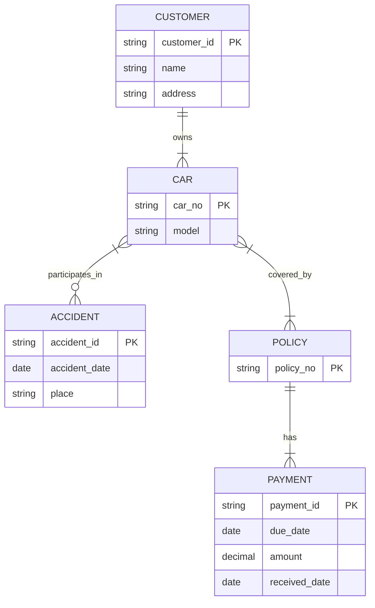

# 第4单元 ER模型与关系模式转换

<!-- toc:start -->
## 知识点索引目录

点击下面的知识点可跳转到对应小节。

- [怎样阅读本章](#ch04-s001)
- [1. 【课程PPT补充知识点】先从一句需求开始](#ch04-s002)
  - [1.1 学生选课业务](#ch04-s003)
  - [1.2 贯穿本章的小数据](#ch04-s004)
  - [1.3 从需求到实现的顺序](#ch04-s005)
- [2. 【课程总结PPT重点知识点】实体、实体集与属性](#ch04-s006)
  - [2.1 实体不是“表里的任意一格”](#ch04-s007)
  - [2.2 属性与码](#ch04-s008)
  - [2.3 简单、复合、单值与多值属性](#ch04-s009)
  - [2.4 派生属性与空值](#ch04-s010)
- [3. 【课程总结PPT重点知识点】联系、联系集、角色与联系属性](#ch04-s011)
  - [3.1 先说一次对应，再说同类对应](#ch04-s012)
  - [3.2 联系的度数与递归角色](#ch04-s013)
  - [3.3 三元联系不能随便拆成三个二元联系](#ch04-s014)
- [4. 【课程总结PPT重点知识点】基数：最多能对应几个](#ch04-s015)
  - [4.1 两个方向都要问](#ch04-s016)
  - [4.2 三种常见关系](#ch04-s017)
- [5. 【课程总结PPT重点知识点】参与约束：至少需要几个](#ch04-s018)
  - [5.1 最大数量与最小数量分别决定](#ch04-s019)
  - [5.2 最小—最大表示法](#ch04-s020)
  - [5.3 图上符号必须与文字配套](#ch04-s021)
- [6. 【课程总结PPT重点知识点】弱实体与识别联系](#ch04-s022)
  - [6.1 订单的第 1 行不是全公司唯一](#ch04-s023)
  - [6.2 部分码与存在依赖](#ch04-s024)
- [7. 【课程总结PPT重点知识点】特化、概化、继承与聚集](#ch04-s025)
  - [7.1 特化和概化是两个观察方向](#ch04-s026)
  - [7.2 两组约束必须分别说明](#ch04-s027)
  - [7.3 聚集：让一项联系整体参与另一项联系](#ch04-s028)
- [8. 【课程PPT补充知识点】建模选择与常见陷阱](#ch04-s029)
  - [8.1 系名是属性还是系实体](#ch04-s030)
  - [8.2 选课是联系还是实体](#ch04-s031)
  - [8.3 避免重复和错误的联系](#ch04-s032)
- [9. 【课程总结PPT重点知识点】逐步转换成关系模式](#ch04-s033)
  - [9.1 先解释转换记号](#ch04-s034)
  - [9.2 强实体：先各建一张表](#ch04-s035)
  - [9.3 多值属性：另建对应表](#ch04-s036)
  - [9.4 弱实体：拥有者码加部分码](#ch04-s037)
  - [9.5 M:N：建联系表并带上联系属性](#ch04-s038)
  - [9.6 1:N：外码通常放在 N 侧](#ch04-s039)
  - [9.7 1:1：外码加唯一性，并考虑哪侧必参与](#ch04-s040)
  - [9.8 特化与概化的三种常见转换](#ch04-s041)
- [10. 【课程总结PPT重点中的重点】完整 ER 模型怎样核对](#ch04-s042)
- [11. 【课程PPT补充知识点】UML 记法](#ch04-s043)
- [12. 常见误解](#ch04-s044)
- [13. 本单元模拟题：汽车保险管理系统](#ch04-s045)
  - [原题](#ch04-s046)
  - [13.1 汽车保险题：从题面逐步推导到记录](#ch04-s047)
    - [第一步：先声明采用的业务解释](#ch04-s048)
    - [第二步：解释每张表并填入小记录](#ch04-s049)
    - [第三步：用这些记录核对两端数量](#ch04-s050)
    - [第四步：解释主码与外码的选择](#ch04-s051)
  - [PPT 参考答案](#ch04-s052)
  - [题面与参考答案的不一致](#ch04-s053)
  - [规范 ER 图](#ch04-s054)
  - [文字化约束说明](#ch04-s055)
  - [转换后的关系模式](#ch04-s056)
  - [完整解析](#ch04-s057)
- [14. 自拟自测题与逐步答案](#ch04-s058)
  - [14.1 图书有多个作者，作者可写多本书](#ch04-s059)
  - [14.2 所有订单都必须至少有一条明细，外码足够吗？](#ch04-s060)
  - [14.3 学生电话号码为什么不直接作为主码？](#ch04-s061)
  - [14.4 在职学生该怎样表示？](#ch04-s062)
- [15. 复习清单](#ch04-s063)

<!-- toc:end -->

> 课件来源：`课程ppt/ch7.pdf`；重点依据：`课程总结.pptx`；原模拟题来源：`试题模拟.pptx`。本章新增记录均为教学用。

<a id="ch04-s001"></a>

## 怎样阅读本章

> **重点中的重点：ER 图必须画完整。** “完整”不仅指实体和连线，还包括属性、主键、映射基数、参与约束、弱实体的标识联系，以及必要的联系属性。

你已经知道表、列和行。本章先解决更早的问题：“现实业务应该画成什么对象和联系，又应该变成哪些表？”**ER**是 Entity–Relationship，即实体—联系。先从业务句子推导，再画图、转表。

**【课程总结PPT重点知识点】**覆盖实体、属性、联系、约束和转换；其中“完整 ER 模型”是总结强调的范围。**【课程PPT补充知识点】**用于课件延伸内容。图形符号不是业务规则本身，画完图还要用文字核对。

<a id="ch04-s002"></a>

## 1. 【课程PPT补充知识点】先从一句需求开始

<a id="ch04-s003"></a>

### 1.1 学生选课业务

学校说：“每名学生有学号、姓名和所属系；每门课有课程号、名称和学分；学生可以选多门课，课程可以被多名学生选；每次选课记一个成绩。”

教学假设：学号、课程号各自唯一；一个学生对一门课程最多一条选课记录；学生可以暂未选课，课程可以暂时没人选；允许跨系选课。

把这段话分为三类：

1. 需要区分的对象：学生、课程。
2. 描述对象的信息：学号、姓名、系；课程号、名称、学分。
3. 对象之间发生的事：选课，以及这一次选课的成绩。

不能只看到名词就建表。“成绩”不是独立学生或课程；它描述某位学生对某门课的这次选课。

<a id="ch04-s004"></a>

### 1.2 贯穿本章的小数据

`student(SID,name,dept)`是学生资料。括号内为列名：SID 学号、name 姓名、dept 学生所在系；一行一个学生。

| SID | name | dept |
| --- | --- | --- |
| S1 | 小林 | 计算机 |
| S2 | 小周 | 数学 |
| S3 | 小陈 | 计算机 |
| S4 | 小吴 | 数学 |

`course(CID,title,dept,credits)`记录课程：CID 课程号、title 名称、dept 开课系、credits 学分；一行一门课。

| CID | title | dept | credits |
| --- | --- | --- | --- |
| C1 | 数据库 | 计算机 | 3 |
| C2 | 程序设计 | 计算机 | 4 |
| C3 | 高数 | 数学 | 5 |

选课事实如下，score 为成绩；一行是一位学生与一门课程的一次对应。

| SID | CID | score |
| --- | --- | --- |
| S1 | C1 | 80 |
| S1 | C2 | 90 |
| S2 | C1 | 70 |
| S3 | C2 | 60 |

这些事实能检验图是否容纳当前数据，但当前四条记录不能证明所有未来业务规则。规则来自需求确认。


<a id="ch04-s005"></a>

### 1.3 从需求到实现的顺序

先做**需求分析**，确认对象、操作和规则；再做**概念设计**，用 ER 表达业务；然后做**逻辑设计**，把 ER 转为关系模式并检查重复；最后做**物理设计**，决定索引和存储方案。“概念”关注业务含义，“逻辑”关注表结构，“物理”关注实际存放与访问。不能未问清是否重修就认定 SID、CID 永远足以标识选课。

<a id="ch04-s006"></a>

## 2. 【课程总结PPT重点知识点】实体、实体集与属性

<a id="ch04-s007"></a>

### 2.1 实体不是“表里的任意一格”

**实体**是业务中可区分的一个对象，例如学号 S1 的学生。**实体集**是同一类实体的集合，例如全部学生。这里“集合”表示把同类对象作为一个整体讨论；两个不同学生即使同名也仍是两个实体。

画 ER 图时，矩形“学生”通常表示学生实体集，而不是仅表示小林。实现时它常转成 student 表，每名学生成为一行。

<a id="ch04-s008"></a>

### 2.2 属性与码

**属性**描述实体的某方面，例如姓名、系。**码**是能唯一识别实体的一组属性；“唯一”意味着不能有两个不同实体持有完全相同的识别值。姓名可能重复，所以本业务用 SID 区分学生。

**候选码**是能唯一识别、且去掉任何组成属性都不能继续唯一识别的组合；“最小”指没有多余属性，不是字符串最短。选择一个候选码作为**主码**。复合码由多列共同组成，选课的 SID 与 CID 就是一例。详细码分类见第 02 章。

<a id="ch04-s009"></a>

### 2.3 简单、复合、单值与多值属性

这是两个不同分类角度。

| 类别 | 白话解释 | 独立业务例子 |
| --- | --- | --- |
| 简单属性 | 在当前用途下不再拆分 | 学号 |
| 复合属性 | 需要分别使用组成部分 | 地址拆为省、市、街道 |
| 单值属性 | 每个实体在该属性上至多一个值 | 本业务每学生一个所属系 |
| 多值属性 | 同一实体可有多个值 | 学生可登记多个联系电话 |

“地址能否拆分”由用途决定，不是在争论文字在物理上能否切开。电话号码多值场景另有教学记录：S1 有 13800000001、13800000002，S2 有 13900000001。不要把两号码塞进一个逗号分隔的字段冒充规范的单值列；后面拆成独立表。

<a id="ch04-s010"></a>

### 2.4 派生属性与空值

**派生属性**是可根据其他数据算出的属性。例如独立生日场景中，根据出生日期和当前日期算年龄；年龄会随时间变，出生日期较稳定。是否存计算结果要考虑更新一致性。

**空值 NULL**表示未知、缺失或不适用等未给出普通值的状态。未登记电话号码不等于号码是“0”。在图里说明一个属性可缺值，还需在转表后落实相应规则。

<a id="ch04-s011"></a>

## 3. 【课程总结PPT重点知识点】联系、联系集、角色与联系属性

<a id="ch04-s012"></a>

### 3.1 先说一次对应，再说同类对应

“小林选了数据库课”是一条**联系**；全部学生与课程的选课对应构成**联系集**。图中菱形“选课”通常表示联系集。

成绩 80 取决于“小林—数据库”这对对象，属于**联系属性**。若把它挂到学生上，小林选两门课就不知该存哪个成绩；挂到课程上，也无法区分不同学生。

<a id="ch04-s013"></a>

### 3.2 联系的度数与递归角色

**度数**是在一类联系中参与的实体角色数量：

- **二元联系**有两方，例如学生—选课—课程。
- **三元联系**有三方，例如教师在某学期教授某课程。
- **递归联系**是同一实体集参与不同角色，例如职工指导职工。

独立指导例：`staff(EID,name)`中 E1 为老王，E2 为小李；E1 指导 E2。`EID`是职工编号。若两边都只写“职工”，容易看不出谁指导谁；应写**指导者**与**被指导者**两个角色。角色是同类对象在联系中的不同身份，不必新建两类职工。

<a id="ch04-s014"></a>

### 3.3 三元联系不能随便拆成三个二元联系

**独立背景**：教师 T1 在秋季教 C1，T1 在春季教 C2；教师 T2 在春季教 C1。记录 `teaching(TID,CID,term)`，列分别教师号、课程号、学期。

| TID | CID | term |
| --- | --- | --- |
| T1 | C1 | 秋 |
| T1 | C2 | 春 |
| T2 | C1 | 春 |

若只分别记录教师—课程、教师—学期、课程—学期，T1 对应 C1、T1 对应春、C1 对应春都存在，拼回时会错误产生 T1 C1 春。三方共同事实不能仅凭三个两方名单恢复。是否能拆，要看额外约束，而不是图看起来更简单就拆。

<a id="ch04-s015"></a>

## 4. 【课程总结PPT重点知识点】基数：最多能对应几个

> **本节为课程总结PPT明确列出的重点知识点：映射基数。**

<a id="ch04-s016"></a>

### 4.1 两个方向都要问

**映射基数**描述一方对象最多对应另一方多少对象。“1”表示最多一个，“N”或“M”表示可以多个，并非指定确切数量。

判断选课，必须分别问：一个学生最多选几门课？一门课最多由几人选？两边都可多个，故是 `M:N`，多对多。

<a id="ch04-s017"></a>

### 4.2 三种常见关系

下列行政规则是为教学另设，不是主例中的额外事实。

| 联系 | 业务假设 | 类型 |
| --- | --- | --- |
| 人员—证件 | 一人至多一证，一证至多属一人 | 1:1，一对一 |
| 系—学生 | 一系可有多名学生，一学生至多属一系 | 1:N，一对多 |
| 学生—课程 | 两边都可多次对应不同对象 | M:N，多对多 |

`1:N`的方向必须说清：系在 1 侧、学生在 N 侧。它不表示一个系恰好一个学生，也不说明学生必须有系；“必须”是下一节的最少数量问题。

<a id="ch04-s018"></a>

## 5. 【课程总结PPT重点知识点】参与约束：至少需要几个

> **本节为课程总结PPT明确列出的重点知识点：参与约束与主键。**

<a id="ch04-s019"></a>

### 5.1 最大数量与最小数量分别决定

**全部参与**表示某实体集的每个实体都必须参加至少一次该联系。**部分参与**允许某些实体一次也不参加。

在主例，S4 没有选课、C3 没有人选，双方都是部分参与。若学校规定每名正式在读学生必须选至少一课，学生端变成全部参与；现有 S4 会不符合新规则。

<a id="ch04-s020"></a>

### 5.2 最小—最大表示法

`(min,max)`记一个对象在该联系中最少、最多能参与多少次。min 是最小数，max 是最大数，N 表示没有在模型中给出有限固定上限。

| 主例实体一侧 | 约束 | 普通语言 |
| --- | --- | --- |
| 学生 | (0,N) | 可不选，也可选多门 |
| 课程 | (0,N) | 可没人选，也可多人选 |

独立“每学生必须属于一个系”的假设中，学生端是 `(1,1)`，系端可为 `(0,N)`。联系的**码约束**表达“至多一个”的限制，例如学生确定所属系；与实体本身的学号主码要区分。

<a id="ch04-s021"></a>

### 5.3 图上符号必须与文字配套

传统 ER 图常用矩形表示实体集、椭圆表示属性、菱形表示联系，下划线标出码，双线表示全部参与，双矩形／双菱形表示弱实体与识别联系。不同记法的箭头和端点含义不同；作答先声明记法，再写“一名学生……，一门课程……”，避免把端点方向看反。

<a id="ch04-s022"></a>

## 6. 【课程总结PPT重点知识点】弱实体与识别联系

> **本节为课程总结PPT明确列出的重点知识点：弱实体集。**

<a id="ch04-s023"></a>

### 6.1 订单的第 1 行不是全公司唯一

**独立业务**：商店每张订单内有行号 1、2、3，但不同订单都可以有第 1 行。`orders(OID,date)`记录订单号和日期；`order_line(OID,line_no,item,quantity)`记录订单号、行号、商品名称、数量。

| OID | line_no | item | quantity |
| --- | --- | --- | --- |
| O1 | 1 | 铅笔 | 2 |
| O1 | 2 | 本子 | 1 |
| O2 | 1 | 橡皮 | 3 |

行号 1 不能区分两张订单的明细；`(OID,line_no)`才唯一。**弱实体**不能只用自身局部属性在所有同类对象中唯一识别，需要结合所属**拥有者实体**的码。这里订单明细是弱实体，订单是拥有者。

<a id="ch04-s024"></a>

### 6.2 部分码与存在依赖

`line_no`叫**部分码**：在同一个订单内部能区分明细，但不是全体明细的主码。订单—明细联系叫**识别联系**，因为它提供完整身份的一部分。

每条明细必须属于一个订单，对识别联系全部参与；它还**存在依赖**于订单，意思是本业务不允许明细脱离订单独立存在。实现时可以通过外码及适当删除规则维护；删除行为需由业务确认。

不要把“有外码”都叫弱实体：若每条明细另有全局唯一明细号，并能据此独立识别，身份模型就可能改变。

<a id="ch04-s025"></a>

## 7. 【课程总结PPT重点知识点】特化、概化、继承与聚集

> **本节包含课程总结PPT明确列出的重点知识点：聚集。** 特化、概化和继承为课程课件中的扩展内容。

<a id="ch04-s026"></a>

### 7.1 特化和概化是两个观察方向

**独立背景**：学校的人包括学生与职工。`person(PID,name)`记录人员号和姓名；学生额外有专业，职工额外有工资。PID 是全校人员标识。

从“人员”向下分出“学生”“职工”叫**特化**；从学生与职工中提取共有姓名、人员号形成“人员”叫**概化**。**继承**表示子类沿用父类属性和联系，例如人员若参与“持有校园证”的联系，学生也继承这种参与资格；学生也有 PID、name，不必在概念上重新发明一套身份。

<a id="ch04-s027"></a>

### 7.2 两组约束必须分别说明

- **不相交**：一人不能同时属两个子类；**重叠**：允许同时属于，例如在职读研者既是职工又是学生。
- **全部特化**：每个人员都至少属一个子类；**部分特化**：可有只属于人员、尚未列入这些子类的人。

是否重叠与是否覆盖全部人员是两个独立问题，不能从“学生、职工”这两个名字推断规则。

<a id="ch04-s028"></a>

### 7.3 聚集：让一项联系整体参与另一项联系

**独立背景**：教师 T1 被安排给 C1 授课，负责人 M1 审核这一次安排。审核的对象是“T1 给 C1 授课”这个整体，不是单独教师或单独课程。

**聚集**把“教师—授课—课程”视为高一级对象，使它能与负责人建立审核联系。这里与 SQL 的 COUNT、AVG“聚集函数”不同，ER 聚集是建模手段，不是在求平均。

若只建“负责人审核教师”和“负责人审核课程”，会丢失审核的是哪次教师课程安排。转表时可用 `review(TID,CID,MID)`，TID 教师号、CID 课程号、MID 负责人号；其码还取决于每次安排可有几位审核人及安排是否含学期。

<a id="ch04-s029"></a>

## 8. 【课程PPT补充知识点】建模选择与常见陷阱

<a id="ch04-s030"></a>

### 8.1 系名是属性还是系实体

若只需记一段所属系文字，可以用学生属性 dept。若还要记录系办公地点、电话、负责人，应考虑系实体，因为系本身成为需要管理的对象。判断依据是业务需要，而不是名字像名词就一定建实体。

<a id="ch04-s031"></a>

### 8.2 选课是联系还是实体

只要描述某学生与某课程的对应及成绩，可作有属性的联系。若一次选课有全局选课号、缴费、撤销历史等独立生命周期，也可设计选课实体再与学生、课程关联。两种表达都必须完整保留业务规则。

<a id="ch04-s032"></a>

### 8.3 避免重复和错误的联系

若学生所属系已经确定，不能在每次选课里又独立存一份可随意不同的学生系；否则两个地方可能矛盾。也不能要求学生系等于开课系，因为业务允许跨系选课。

<a id="ch04-s033"></a>

## 9. 【课程总结PPT重点知识点】逐步转换成关系模式

> **本节为课程总结PPT明确列出的重点知识点：关系模式转换。**

<a id="ch04-s034"></a>

### 9.1 先解释转换记号

**关系模式**是表结构的正式描述。`R(a,b)`表示表 R 有列 a、b；**PK**是 Primary Key，主码；**FK**是 Foreign Key，外码。箭头 `→`在此表示“引用到哪张表哪列”，不是第 05 章函数依赖的箭头；语境不同要读不同含义。

<a id="ch04-s035"></a>

### 9.2 强实体：先各建一张表

能用自身码独立识别的实体通常称**强实体**。主例学生、课程各建表：
```text
student(SID PK, name, dept)
course(CID PK, title, dept, credits)
```
结果就是第 1 节的两张完整表，不需要把全部选课挤进 student 的一格。

复合属性若各部分需要单独使用，转换时拆成列，例如 `address_province,address_city,address_street`；三个列名分别省、市、街道。

<a id="ch04-s036"></a>

### 9.3 多值属性：另建对应表

第 2 节的电话号码转换成 `student_phone(SID,phone)`，phone 为一个号码：

| SID | phone |
| --- | --- |
| S1 | 13800000001 |
| S1 | 13800000002 |
| S2 | 13900000001 |

PK=(SID,phone)，SID 是指向 student.SID 的 FK。这个组合在“同一学生不重复登记同一号码”的假设下唯一；若允许多个学生共用电话，就不能单把 phone 当主码。

<a id="ch04-s037"></a>

### 9.4 弱实体：拥有者码加部分码

第 6 节转成 `order_line(OID,line_no,item,quantity)`。PK=(OID,line_no)，FK OID 引用 orders.OID。O1 的 1 行与 O2 的 1 行不冲突，说明组合身份正是业务需要。拥有者—明细的识别联系通常不用再单独建重复对应表。

<a id="ch04-s038"></a>

### 9.5 M:N：建联系表并带上联系属性

学生选课转成 `takes(SID,CID,score)`：

- PK=(SID,CID)，由“一对学生课程最多一条选课”推出；
- SID 引用 student.SID；CID 引用 course.CID；
- score 保存在这张联系表，描述该配对。

完整数据是第 1 节的四条选课。若用 student 表加一个 CID 列，S1 的 C1、C2 无法在同一学生行里同时表达；如果重复学生行，又重复姓名与系。独立联系表避免这个问题。

<a id="ch04-s039"></a>

### 9.6 1:N：外码通常放在 N 侧

**独立行政业务**：每学生必须属一个系，一系可有多个学生。系表 `department(DID,dname)`：DID 系号，dname 系名；教学数据 D1 计算机、D2 数学。学生表另增加 DID。

| SID | name | DID |
| --- | --- | --- |
| S1 | 小林 | D1 |
| S2 | 小周 | D2 |
| S3 | 小陈 | D1 |
| S4 | 小吴 | D2 |

DID 在学生表是 FK；不加 UNIQUE，因为多个学生可以同系。要表达每个学生必须有系，加 NOT NULL。反过来在 department 放一个 SID，只能记一个学生，违反“一系多人”。

<a id="ch04-s040"></a>

### 9.7 1:1：外码加唯一性，并考虑哪侧必参与

**独立业务**：每学生必须有一张校园证，证件只属于一个学生。`card(CardID,SID)`列为证件号、学生号。CardID 作主码，SID 作外码且 UNIQUE、NOT NULL，保证每张证有学生，且学生至多一证。

但仅这几个约束不能保证“每位学生至少有证”，因为可以单独插入一个没有任何 card 行的学生。若双方身份生命周期一致，可考虑合并；否则需要额外检查机制。不能把 FK 自动当成“被引用者至少有一条子记录”。

<a id="ch04-s041"></a>

### 9.8 特化与概化的三种常见转换

仍用第 7 节人员场景。对教学对象 P1 小林（学生，专业计算机）与 P2 老王（职工，工资 6000），可以：

| 方案 | 表结构 | 代价和条件 |
| --- | --- | --- |
| 父表加子表 | person(PID,name)、student_type(PID,major)、staff_type(PID,salary) | 共享身份清晰；看完整子类信息需连接 |
| 每子类一张完整表 | student_type(PID,name,major)、staff_type(PID,name,salary) | 全部覆盖时可表达所有人员；重叠人员共有属性会重复 |
| 单表加类型和可空列 | person_all(PID,name,is_student,is_staff,major,salary) | 用两个标记容纳重叠；不适用列需允许空 |

`major`是专业，`salary`是工资，`is_student/is_staff`是是否属于对应子类的标记。若只用一个类型列写“学生或职工”，就无法直接表达两种身份同时存在。哪种方案正确取决于覆盖、重叠、空值及约束需求，不是唯一固定模板。

<a id="ch04-s042"></a>

## 10. 【课程总结PPT重点中的重点】完整 ER 模型怎样核对

先逐句核对需求，再对每项问：

1. 对象是否都有身份？例如学生能否用学号区分。
2. 属性挂在哪个对象或配对上？例如成绩是否在选课。
3. 联系两个方向的最大数量是多少？
4. 每个方向允许零次吗？
5. 弱实体的拥有者与部分码是否写明？
6. 子类的重叠／不相交、全部／部分是否写明？
7. 转表后哪些规则由 PK、FK、UNIQUE、NOT NULL 保证，哪些还需要额外机制？

**业务最少数量**往往不能只靠普通外码保证。例如“每张保单至少有一次赔付”需要检查它是否有子记录，不能认为 payment.policy_id 的 FK 已保证此事。

<a id="ch04-s043"></a>

## 11. 【课程PPT补充知识点】UML 记法

UML 是统一建模语言，常用于软件设计，也可描述对象、属性和关联。类框中写对象类别与属性，关联端写多重性。

`0..*`表示零到任意多个，`1..*`表示至少一个，`0..1`表示零或一个，`1`表示恰好一个。点点表示范围，星号表示这里不设有限固定上限。例如学生—课程主例两端均为 0..*。UML 与传统 ER 图形不同，业务含义应一致。

<a id="ch04-s044"></a>

## 12. 常见误解

| 错误 | 用主例检查 | 修正 |
| --- | --- | --- |
| 名词都必须变实体 | 成绩描述一次选课 | 先问是否独立识别与管理 |
| 1:N 只需看一个方向 | 系可多人，学生只一系 | 两个方向分别问 |
| 多对多在某侧加一列外码即可 | S1 有 C1、C2 | 建联系表 |
| 只要有外码就是弱实体 | 是否需要拥有者码参与身份 | 区分引用与识别依赖 |
| FK 保证父实体一定有子实体 | S4 可没有选课 | “至少一个”需另落实 |


<a id="ch04-s045"></a>

## 13. 本单元模拟题：汽车保险管理系统

<a id="ch04-s046"></a>

### 原题

> 某汽车保险公司欲开发一套管理系统，其需要记录的数据如下：  
> 顾客：顾客ID、名字、家庭住址；  
> 汽车：汽车编号、类型、所有顾客ID；  
> 事故：事故编号、日期、位置；  
> 保险赔付：赔付ID、截止日期、金额、实际赔付日期；  
> 保险单：保险单号、保险赔付ID。  
> 其中，每位顾客可以有1辆或多辆汽车；每辆汽车可以关联0个或者多个事故，每个事故可以关联1到多辆车；1个保险单可以覆盖1辆或多辆汽车，1辆车可以关联1到多个保险单；保险单可关联一个或多个保险赔付。  
> （1）设计 E-R 图；（2）转换为关系模式；（3）指出每个关系模式的主码。

<a id="ch04-s047"></a>

### 13.1 汽车保险题：从题面逐步推导到记录

<a id="ch04-s048"></a>

#### 第一步：先声明采用的业务解释

保险公司要记顾客、汽车、事故、保单和赔付。以下新增数据都是**教学用**，用来检验下文的参考转换，不是题目原给数据。

题面已说明一顾客可多车；我们依照“所有顾客ID”解释为每车恰属一位顾客。题面没有明说一笔赔付能否属于多张保单，以下采用“一笔赔付属于一张保单”的常用假设，与 PPT 参考表 payment 中单个 policy_id 一致。若教师要求赔付可跨保单，应改成多对多联系表，不能沿用此答案。

原题保单属性与一对多叙述矛盾，采用叙述；不增添题面未给出的保险金额。赔付日期可在尚未实际支付时为空，这是教学数据的补充假设。

<a id="ch04-s049"></a>

#### 第二步：解释每张表并填入小记录

customer_id 为顾客编号，name 姓名，address 家庭住址；一行一顾客。

| customer_id | name | address |
| --- | --- | --- |
| U1 | 小林 | 松林路 |
| U2 | 小周 | 校园路 |

car_no 为汽车编号，model 为类型，customer_id 为所有者；一行一汽车。

| car_no | model | customer_id |
| --- | --- | --- |
| V1 | 轿车 | U1 |
| V2 | SUV | U1 |
| V3 | 轿车 | U2 |

accident_id 为事故号，accident_date 日期，place 位置；一行一事故。

| accident_id | accident_date | place |
| --- | --- | --- |
| A1 | 2026-09-01 | 路口 |

policy_no 为保单号；一行一保单。它不直接保存某一个赔付号。

| policy_no |
| --- |
| P1 |
| P2 |

参与事故表：一行表示一车参加一事故。

| car_no | accident_id |
| --- | --- |
| V1 | A1 |
| V3 | A1 |

覆盖表：一行表示一保单覆盖一汽车。

| car_no | policy_no |
| --- | --- |
| V1 | P1 |
| V2 | P1 |
| V3 | P2 |

payment_id 为赔付号，due_date 截止日期，amount 金额，received_date 实际赔付日期，policy_no 所属保单；一行一笔赔付。

| payment_id | due_date | amount | received_date | policy_no |
| --- | --- | --- | --- | --- |
| M1 | 2026-10-01 | 1000 | 2026-09-20 | P1 |
| M2 | 2026-11-01 | 500 | NULL | P1 |
| M3 | 2026-10-15 | 800 | 2026-10-02 | P2 |

<a id="ch04-s050"></a>

#### 第三步：用这些记录核对两端数量

U1 两辆车、U2 一辆车，且每车一位主人，符合顾客—汽车 1:N。V2 无事故，V1、V3 各一次；A1 有两车，符合汽车可零事故、事故至少一车。

P1 覆盖两车，P2 一车；每车至少一保单，符合题意。此小数据虽未让某车有两保单，模型仍必须允许未来出现多保单，而不能从三条样本误推成“一车只能一保单”。

P1 两笔赔付、P2 一笔，解释了为什么 payment 保存 policy_no，而不是 policy 只放一个 payment_id。

<a id="ch04-s051"></a>

#### 第四步：解释主码与外码的选择

五个对象表分别以顾客号、车号、事故号、保单号、赔付号作主码。两个多对多对应表采用组合主码：

- PARTICIPATION 的 (car_no,accident_id)，同一车对同一事故不重复登记。
- COVERAGE 的 (car_no,policy_no)，同一车对同一保单不重复登记。

CAR.customer_id、PAYMENT.policy_no 和两个对应表的两列分别是外码。仅声明这些 PK／FK，还不能保证每位顾客至少一辆车、每保单至少一赔付；这些最少数量要由额外约束机制或业务事务检查落实。

图中 `string`意为文字类型，`date`日期类型，`decimal`精确小数类型；`PK`主码。Mermaid 的 `||`表示恰好一个，`o{`表示零到多个，`|{`表示一个到多个。线上靠某端的符号表示“对另一端的一个对象，这端允许几个对象”，因此要反向读端点。即使渲染器不显示图，文字数量说明和这七张表仍给出了完整答案。


<a id="ch04-s052"></a>

### PPT 参考答案

PPT 文本页给出以下关系：

```text
customer(customer_id, name, address)
car(car_no, model, customer_id)
policy(policy_id, 保险金额)
accident(accident_id, date, place)
participat(car_no, accident_id)
cover(car_no, policy_id)
payment(pay_id, due_date, amount, received_date, policy_id)
```

<a id="ch04-s053"></a>

### 题面与参考答案的不一致

1. 题面把“保险赔付ID”列为保险单属性，同时又说明一张保险单关联一个或多个赔付。这两种描述冲突。若为一对多，应由赔付记录保存保险单号。
2. PPT 答案中的“保险金额”没有出现在题面保险单属性列表中。
3. `participat` 疑为 `participate` 的拼写简化，不影响关系含义。

以下答案以业务叙述中的联系约束为准，不凭空加入保险金额。

<a id="ch04-s054"></a>

### 规范 ER 图



<a id="ch04-s055"></a>

### 文字化约束说明

- 顾客与汽车为 `1:N`。每位顾客至少拥有一辆汽车，每辆汽车按题意属于一位顾客。
- 汽车与事故为 `M:N`。汽车可不发生事故，也可关联多次事故；每次事故至少关联一辆汽车。
- 汽车与保险单为 `M:N`，两侧按题意都至少参与一次。
- 保险单与保险赔付为 `1:N`。每张保险单至少有一条赔付记录，每条赔付记录归属于一张保险单。

Mermaid 连线端的符号表示**该端实体对另一端一个实体的可参与数**。例如汽车—事故线上，靠汽车端的 `|{` 表示每次事故至少有一辆车，靠事故端的 `o{` 表示一辆车可以没有事故。它与下面的文字约束互相校验。

<a id="ch04-s056"></a>

### 转换后的关系模式

```text
CUSTOMER(
    customer_id PK,
    name,
    address
)

CAR(
    car_no PK,
    model,
    customer_id FK → CUSTOMER.customer_id
)

ACCIDENT(
    accident_id PK,
    accident_date,
    place
)

POLICY(
    policy_no PK
)

PARTICIPATION(
    car_no FK → CAR.car_no,
    accident_id FK → ACCIDENT.accident_id,
    PK(car_no, accident_id)
)

COVERAGE(
    car_no FK → CAR.car_no,
    policy_no FK → POLICY.policy_no,
    PK(car_no, policy_no)
)

PAYMENT(
    payment_id PK,
    due_date,
    amount,
    received_date,
    policy_no FK → POLICY.policy_no
)
```

<a id="ch04-s057"></a>

### 完整解析

1. `CUSTOMER`、`CAR`、`ACCIDENT`、`POLICY`、`PAYMENT` 都有独立标识和属性，因此建为实体。
2. 顾客到汽车是 `1:N`，把顾客主码放入 `CAR` 即可，不需要单独的拥有关系表。
3. 汽车到事故是 `M:N`，必须建立 `PARTICIPATION`，复合主码防止同一汽车和事故组合重复。
4. 汽车到保险单也是 `M:N`，建立 `COVERAGE`。
5. 保险单到赔付是 `1:N`，把 `policy_no` 放入 `PAYMENT`。
6. 关系模式中的外码能表达最大基数的一部分，但“每位顾客至少一辆车”“每张保险单至少覆盖一辆车”等全局最小参与约束，通常还需要事务逻辑、延迟约束或触发器配合检查。

**题面假设的边界**：题面同时写了“保险单含保险赔付ID”和“一张保险单关联多个赔付”，两者不能直接当作同一种 1:N 存储方式。这里以联系叙述为准，让 `PAYMENT.policy_no` 指向保险单；若教师希望按属性列表作答，应先要求澄清赔付和保险单究竟谁从属于谁。图中汽车与顾客、保险单与赔付的“至少一条”属于跨行存在性约束，单靠列级 `NOT NULL` 也不能保证。


<a id="ch04-s058"></a>

## 14. 自拟自测题与逐步答案

以下四题为自拟题。

<a id="ch04-s059"></a>

### 14.1 图书有多个作者，作者可写多本书

**背景**：书有唯一书号，作者有唯一作者号，署名顺序属于一本书与一位作者的配对。问怎样转表？

**推导**：两边都可多个，是 M:N；署名顺序不属于作者自身，否则同一作者在不同书中顺序不能不同。建 book(BookID,title)、author(AuthorID,name)、authorship(BookID,AuthorID,position)。BookID 书号，title 书名，AuthorID 作者号，name 姓名，position 署名顺序。

**结论**：前两表各用编号作主码；联系表用 (BookID,AuthorID) 作主码、两编号作外码，并按业务另检查同书署名顺序是否唯一。

<a id="ch04-s060"></a>

### 14.2 所有订单都必须至少有一条明细，外码足够吗？

**背景**：采用第 6 节 orders 与 order_line，明细 OID 非空且引用订单。问题是能否保证没有空订单。

**推导**：外码检查每条明细能找到订单，不检查每张订单能找到明细。可插入 O3 而不插任何明细，现有外码不会因此失败。

**结论**：不够；需额外检查“至少一条”，并考虑订单创建过程是否允许暂时为空、什么时候必须检查。

<a id="ch04-s061"></a>

### 14.3 学生电话号码为什么不直接作为主码？

**背景**：学生可以登记多个电话，家庭共用一个号码也允许。表 student_phone(SID,phone) 如第 9 节。

**推导**：phone 可能对应两名学生，单独不唯一；SID 可能对应两号码，也单独不唯一。同学生不重复登记同号码，组合唯一。

**结论**：以 (SID,phone) 为主码；SID 是引用学生的外码。

<a id="ch04-s062"></a>

### 14.4 在职学生该怎样表示？

**背景**：一人可以同时是学生与职工，可能还有未归入这两类的人员。

**推导**：允许同时属于两类，所以是重叠；允许人员没有这两个身份，所以是部分特化。父表 person 保存共有身份，两个子表可各自含同一 PID。

**结论**：重叠、部分特化；可用父表加子表，不能未经说明只设一个二选一类型值。

<a id="ch04-s063"></a>

## 15. 复习清单

- [ ] 每个例子先能说清对象、属性与一次联系。
- [ ] 能分别回答两端最多几次、至少几次。
- [ ] 能解释弱实体为什么要组合身份。
- [ ] 能把各种实体与联系逐步转成表，说明每个 PK／FK。
- [ ] 能指出普通键约束尚不能保证的最少数量。
- [ ] 能说明保险题的原材料矛盾与采用假设。

下一章[关系数据库规范化](05_关系数据库规范化.md)进一步检验这些表是否重复保存同一事实。

